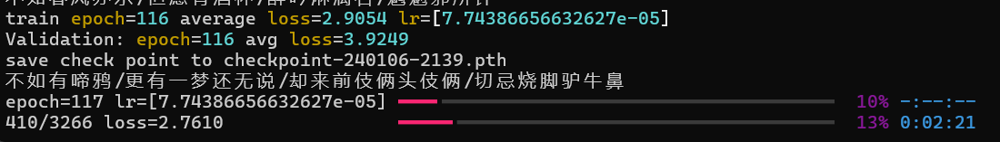
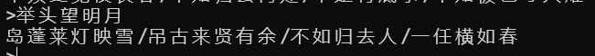
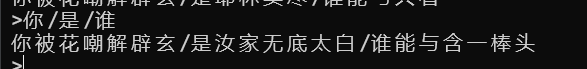

# Poetry Generate

基于Transformer的诗句生成模型，效果不算完美。

这是训练116次之后的效果

## Usage

有两种生成模式

1. 直接生成一首诗，输入风格输出整首诗

1. 输入每一句诗的开头，输出藏头诗

## Data Source

数据来源于[ChinesePoetryDataset](https://www.kaggle.com/datasets/qianboao/chinesepoetrydataset)，训练只采用了前5W行。